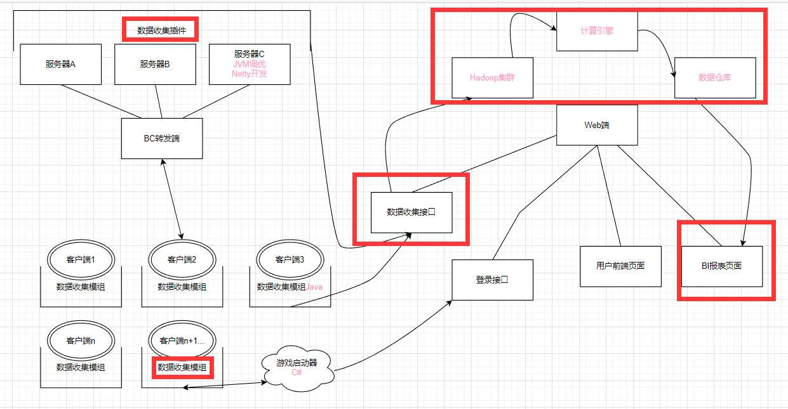

***\*项目框架初始化\****

	

- 这个模块负责实现服务端数据收集插件

​	

- 这个模块负责实现Web端的接口

	

- 这个模块负责Flink端的应用开发

服务端数据收集插件开发

一、日志收集和写出部分(已完成)

1. 向日志服务器发送何种数据?

- 生物类实体
- 掉落类实体物品
- tile类(头颅、箱子、信标、牌子、发射器、投掷器、旗帜、盔甲架等等都属于Tile)

1. 如何收集指定种类数据?

- 当各种事件触发时(生物生成，物品掉落，tile生成)

将数据放入队列中，等待发送至日志服务器

- 数据以JSON格式传输至日志服务器

对于游戏新生成的实体数据条目，使用1标识

对于游戏已销毁的实体数据条目，使用-1标识

(Bukkit API未提供实体销毁事件，我们使用BKCommonLib 来实现)

1. 如何向日志服务器发送数据?

- 使用HTTP长连接，向日志服务器接口POST数据

https://www.51cto.com/article/712374.html

***Web端接收到的日志信息↓***

二、对服务端的反馈(制作中)**

- 服务端从mysql中取出聚类中心坐标，并对坐标中心进行定点清除，参照dbscan

Web端开发

一、BI接口开发(制作中)

- 能从Mysql中读出数据，展示在百度或其它平台的BI页面上

二、日志接口开发(正在研究怎么写入pravega)

- 需要接收服务端发来的日志信息，写入消息队列

Flink应用开发

一、集群搭建(搭建中)

- 搭建pravega和alink集群

二、Pravega数据仓库建模(待后续讨论)

- 两层即可，第一层存放原始日志，第二层看情况，如果有必要可以第三层，考虑到最后的报表生成

三、实时数据计算(待后续讨论聚类方案)

- 对日志数据进行dbscan聚类，得到中心region坐标(参考DBSCAN插件代码实现)，将聚类结果写入mysql
- 需要分别计算  掉落物、生物、tiles 三种不同类别的中心region坐标

四、报表生成

- 通过数仓建模，实时统计传入日志信息中的生物数据，玩家数据等，写出到mysql

